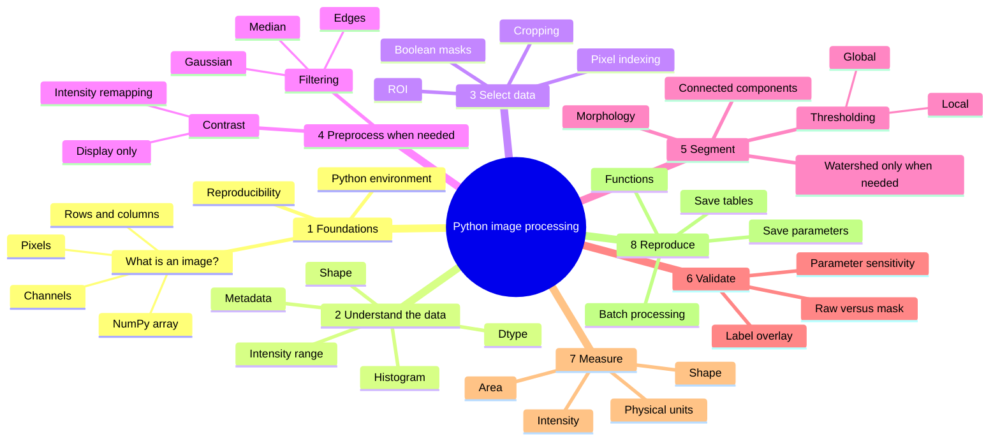
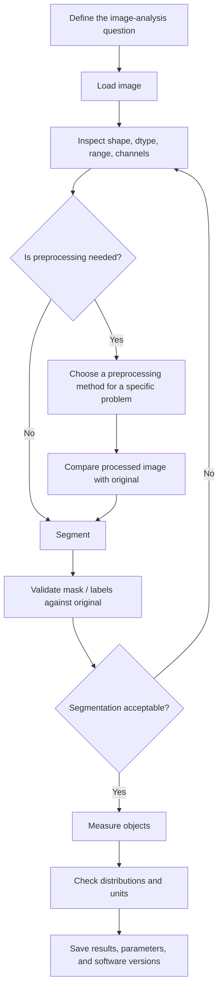

# Python Image Processing: A Practical Beginner Course

**Author: Md. Mobarak Karim, Ph.D.**

A structured, beginner-friendly course for learning **how to think about image processing in Python**, not just how to copy image-processing code.

The course uses **NumPy**, **Matplotlib**, **scikit-image**, **pandas**, and **imageio**. It moves from the basic idea that an image is an array to a complete, reproducible workflow for segmentation and object measurement.

## What this course teaches differently

Every major operation is explained through four questions:

1. **Why** do we need this step?
2. **When** is this function a reasonable choice?
3. Which **parameter** controls its behavior?
4. What should we **inspect afterward** to decide whether it worked?

The notebooks intentionally avoid unnecessary complexity. The goal is to build enough understanding that a learner can look at a new image and make a sensible first processing decision.

## Learning philosophy

The course does **not** teach this:

```text
image → copy code → get result
```

It teaches this:

```text
question → understand data → choose method → inspect result → validate → measure
```

That distinction is the foundation of reproducible scientific image analysis.

## Learning mind map



GitHub renders Mermaid diagrams directly in Markdown.

## Logical analysis workflow



## Course roadmap

| Notebook | Core question | Main concepts |
|---|---|---|
| `00` | What is image processing in Python? | Image as array, display vs processing vs segmentation vs measurement, workflow |
| `01` | How do I access and select pixels? | Rows/columns, indexing, slicing, masks, dtype-safe arithmetic |
| `02` | What exactly is stored in my image? | Grayscale/RGB, dtype, range, display mapping, safe I/O |
| `03` | How are intensities distributed? | Histograms, percentiles, contrast stretching, global/local enhancement |
| `04` | What kind of filtering should I use? | Noise types, Gaussian, median, Sobel, parameter trade-offs |
| `05` | How do I make a binary object mask? | Otsu, local thresholding, morphology, foreground polarity |
| `06` | How do I turn a mask into individual objects? | Connected components, labels, overlays, watershed |
| `07` | How do I quantify objects? | `regionprops_table`, pandas, physical units, QC |
| `08` | How should I handle channels? | RGB vs scientific multichannel data, channel-specific analysis |
| `09` | How do I make the analysis reusable? | Functions, explicit parameters, pathlib, batch processing |
| `10` | How do I combine everything correctly? | End-to-end workflow, validation, sensitivity, reproducibility |

## Two companion guides

### [`FUNCTION_GUIDE.md`](FUNCTION_GUIDE.md)

Use this when you know the task but are unsure which function to try.

Examples:

- “My image has salt-and-pepper noise. Gaussian or median?”
- “Should I use global or local thresholding?”
- “When do I need watershed?”
- “What is the difference between `astype(float)` and `img_as_float()`?”

### [`CHEATSHEET.md`](CHEATSHEET.md)

Use this after you understand the concept and only need to remember the syntax.

## Installation

### Option A — Miniforge / conda

Recommended for a clean scientific-Python environment.

```bash
conda env create -f environment.yml
conda activate pyimage-beginner
jupyter lab
```

### Option B — Python `venv` + pip

```bash
python -m venv .venv

# Windows
.venv\Scripts\activate

# macOS / Linux
source .venv/bin/activate

python -m pip install -r requirements.txt
jupyter lab
```

The environment targets the current course API, including **scikit-image 0.26**.

## How to study effectively

For each notebook:

1. Read the concept before the code.
2. Before running a code cell, predict what it should do.
3. Run it.
4. Inspect the output.
5. Change **one** parameter.
6. Explain what changed and why.
7. Complete the practice section.

A learner who can explain *why* a parameter changed the result has learned more than a learner who only produced the expected image.

## Comment style

The code contains comments explaining:

- the analytical purpose of a line or block,
- when a function is appropriate,
- the meaning of important parameters,
- the main failure mode or trade-off.

The repository intentionally does not add comments to every obvious Python statement. Excessive comments make scientific code harder to scan.

## Core function families

| Task | Main library / module |
|---|---|
| Array operations | `numpy` |
| Display and plots | `matplotlib.pyplot` |
| Intensity / contrast | `skimage.exposure` |
| Filtering / thresholds | `skimage.filters` |
| Mask cleanup | `skimage.morphology` |
| Segmentation | `skimage.segmentation` |
| Object labeling / measurement | `skimage.measure` |
| Color conversion | `skimage.color` |
| Measurement tables | `pandas` |
| Standard file I/O | `imageio.v3` |

## Data and image examples

The core lessons use:

- example images from `skimage.data`,
- a synthetic multichannel fluorescence-style example created in code.

This keeps the course reproducible and lightweight. It also avoids carrying over the image collection from the upstream repository.

For your own research data, put **copies** in `data/raw/`. Keep authoritative raw data backed up separately.

## Scientific-image caution

A standard image file reader is sufficient for many PNG/TIFF/JPEG examples, but real microscopy data may require a metadata-aware workflow. Physical pixel size, z-spacing, time points, detector settings, and channel identity can be essential to quantitative analysis.

## Scope

This is a **beginner-to-practical** course. It intentionally stops before:

- deep learning,
- registration,
- deconvolution,
- large 3-D/4-D datasets,
- GPU acceleration,
- advanced microscopy file standards,
- production application development.

Those subjects become easier after the core workflow in this repository is comfortable.

## Author

**Md. Mobarak Karim, Ph.D.**  
GitHub: [Mobarak-Karim](https://github.com/Mobarak-Karim)

## Technical references

The course structure and function usage were cross-checked against current official documentation:

1. scikit-image User Guide — https://scikit-image.org/docs/stable/user_guide/
2. scikit-image Getting Started — https://scikit-image.org/docs/stable/user_guide/getting_started
3. NumPy for Images — https://scikit-image.org/docs/stable/user_guide/numpy_images.html
4. scikit-image Thresholding Guide — https://scikit-image.org/docs/stable/auto_examples/applications/plot_thresholding_guide.html
5. scikit-image API — https://scikit-image.org/docs/stable/api/skimage
6. scikit-image Morphology API — https://scikit-image.org/docs/stable/api/skimage.morphology
7. NumPy documentation — https://numpy.org/doc/stable/
8. Matplotlib documentation — https://matplotlib.org/stable/
9. Jupyter — https://jupyter.org/
10. GitHub Mermaid diagrams — https://docs.github.com/en/get-started/writing-on-github/working-with-advanced-formatting/creating-diagrams

## Upstream acknowledgement

The repository concept was inspired by `guiwitz/PyImageCourse_beginner`, a beginner image-processing course using Python and Jupyter notebooks.

This version uses an independently reorganized curriculum, rewritten explanations, updated API usage, different example strategy, expanded function-selection guidance, and a stronger emphasis on reproducible scientific reasoning. If the repository retains fork history, earlier commits may still contain upstream material under its original terms.

## License

New material in this rewrite is released under the MIT License. See `LICENSE` and `NOTICE.md`.
