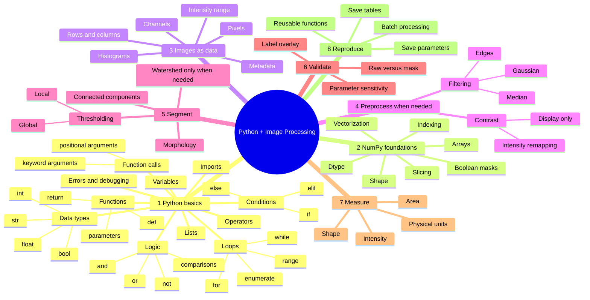
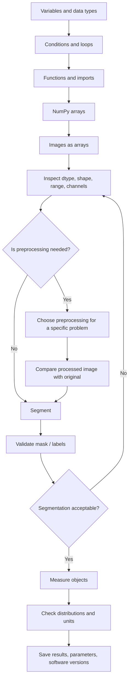

# Python Image Processing: A Practical Beginner Course

**Author: Md. Mobarak Karim, Ph.D.**

A structured, beginner-friendly course for learning **Python first and image processing second**. No previous Python programming experience is assumed.

The course begins with variables, data types, lists, function calls, conditions, loops, user-defined functions, imports, and debugging. Only after those foundations does it move into **NumPy**, **Matplotlib**, **scikit-image**, **pandas**, and **imageio** for practical scientific image analysis.

## Start here if you are new to Python

Do these lessons **before** the image-processing notebooks:

1. [`00_python_basics_1_variables_types.ipynb`](notebooks/00_python_basics_1_variables_types.ipynb) — variables, types, lists, indexing, arithmetic, comparisons, and how function calls work.
2. [`00_python_basics_2_logic_loops.ipynb`](notebooks/00_python_basics_2_logic_loops.ipynb) — Boolean logic, `if/elif/else`, `for`, `while`, `range`, `enumerate`, `break`, and `continue`.
3. [`00_python_basics_3_functions_imports_errors.ipynb`](notebooks/00_python_basics_3_functions_imports_errors.ipynb) — writing functions, parameters vs arguments, return values, imports, dot notation, errors, and debugging.
4. [`00_setup_and_workflow.ipynb`](notebooks/00_setup_and_workflow.ipynb) — environment, Jupyter workflow, and the full image-analysis mental model.
5. [`01_python_numpy_for_images.ipynb`](notebooks/01_python_numpy_for_images.ipynb) — NumPy arrays and the bridge from Python data structures to images.

If those five notebooks feel comfortable, continue through the image-processing sequence in order.

## What this course teaches differently

Every major operation is explained through four questions:

1. **Why** do we need this step?
2. **When** is this function a reasonable choice?
3. Which **parameter** controls its behavior?
4. What should we **inspect afterward** to decide whether it worked?

The notebooks intentionally avoid unnecessary complexity. The goal is to build enough understanding that a learner can read unfamiliar scientific Python code and make a sensible first processing decision.

## Learning philosophy

The course does **not** teach this:

```text
copy code → run code → hope the result is correct
```

It teaches this:

```text
learn Python → understand arrays → define question → choose method → inspect → validate → measure
```

That distinction is the foundation of reproducible scientific image analysis.

## Learning mind map



GitHub renders Mermaid diagrams directly in Markdown.

## From Python syntax to an image-analysis pipeline



## Complete course roadmap

| Order | Notebook | Core question | Main concepts |
|---:|---|---|---|
| 1 | `00_python_basics_1_variables_types.ipynb` | How do I read basic Python code? | Variables, types, lists, indexing, operators, function calls |
| 2 | `00_python_basics_2_logic_loops.ipynb` | How does Python make decisions and repeat work? | Boolean logic, `if/elif/else`, `for`, `while`, `range`, `enumerate` |
| 3 | `00_python_basics_3_functions_imports_errors.ipynb` | How do I organize reusable Python code? | `def`, parameters, arguments, `return`, imports, modules, errors |
| 4 | `00_setup_and_workflow.ipynb` | What is image processing in Python? | Environment, Jupyter, image-analysis workflow |
| 5 | `01_python_numpy_for_images.ipynb` | How do Python arrays become images? | NumPy, rows/columns, slicing, masks, dtype-safe arithmetic |
| 6 | `02_read_display_and_image_types.ipynb` | What exactly is stored in my image? | Grayscale/RGB, dtype, range, display mapping, safe I/O |
| 7 | `03_contrast_histograms_and_intensity.ipynb` | How are intensities distributed? | Histograms, percentiles, contrast stretching, enhancement |
| 8 | `04_filtering_noise_and_edges.ipynb` | What kind of filtering should I use? | Noise types, Gaussian, median, Sobel, parameter trade-offs |
| 9 | `05_thresholding_and_morphology.ipynb` | How do I make a binary object mask? | Otsu, local thresholding, morphology, foreground polarity |
| 10 | `06_segmentation_and_labels.ipynb` | How do I turn a mask into individual objects? | Connected components, labels, overlays, watershed |
| 11 | `07_measurements_and_tables.ipynb` | How do I quantify objects? | `regionprops_table`, pandas, physical units, QC |
| 12 | `08_color_and_multichannel_images.ipynb` | How should I handle channels? | RGB vs scientific multichannel data, channel-specific analysis |
| 13 | `09_batch_processing_pipeline.ipynb` | How do I make the analysis reusable? | Functions, explicit parameters, pathlib, batch processing |
| 14 | `10_final_project.ipynb` | How do I combine everything correctly? | End-to-end workflow, validation, sensitivity, reproducibility |

## What a beginner should understand before segmentation

Before moving to thresholding and segmentation, you should be able to explain these statements:

```python
threshold = 150
mask = image > threshold
```

You should understand that:

- `threshold` is a variable,
- `150` is a numeric value,
- `image` is usually a NumPy array,
- `>` is a comparison operator,
- the comparison is applied to pixels,
- the result is a Boolean array,
- that Boolean array can be used as a mask.

If any part of that feels unclear, revisit the Python and NumPy foundation notebooks before continuing.

## Two companion guides

### [`FUNCTION_GUIDE.md`](FUNCTION_GUIDE.md)

Use this when you know the image-processing task but are unsure which function to try.

Examples:

- “My image has salt-and-pepper noise. Gaussian or median?”
- “Should I use global or local thresholding?”
- “When do I need watershed?”
- “What is the difference between `astype(float)` and `img_as_float()`?”

### [`CHEATSHEET.md`](CHEATSHEET.md)

Use this after you understand the concept and only need to remember syntax.

## Installation

### Option A — Miniforge / conda

Recommended for a clean scientific-Python environment.

```bash
conda env create -f environment.yml
conda activate pyimage-beginner
jupyter lab
```

### Option B — Python `venv` + pip

```bash
python -m venv .venv

# Windows
.venv\Scripts\activate

# macOS / Linux
source .venv/bin/activate

python -m pip install -r requirements.txt
jupyter lab
```

The environment targets the current course API, including **scikit-image 0.26**.

## How to study effectively

For each notebook:

1. Read the concept before the code.
2. Before running a code cell, predict what it should do.
3. Run it.
4. Inspect the output.
5. Change **one** value or parameter.
6. Explain what changed and why.
7. Complete the practice section.
8. Try to rewrite one example without looking at the original code.

A learner who can explain *why* the code works has learned more than a learner who only produced the expected output.

## Comment style

The code contains comments explaining:

- what unfamiliar Python syntax means,
- why an analysis step is being performed,
- when a function is appropriate,
- the meaning of important parameters,
- the main failure mode or trade-off.

Comments are intentionally focused on **reasoning**, not on narrating every obvious character in the code.

## Core Python ideas used throughout the course

| Python idea | Why it matters in image analysis |
|---|---|
| Variables | Store images, thresholds, paths, parameters, and results |
| Lists | Store filenames, channels, measurements, or parameter choices |
| Comparisons | Build logical decisions and image masks |
| `if/elif/else` | Make processing decisions and perform QC checks |
| `for` loops | Process multiple images or repeated conditions |
| Functions | Make analysis reusable and reproducible |
| Imports | Access NumPy, scikit-image, Matplotlib, pandas, etc. |
| Errors | Diagnose environment, file, indexing, and type problems |
| Keyword arguments | Make scientific function calls readable and explicit |

## Core scientific function families

| Task | Main library / module |
|---|---|
| Array operations | `numpy` |
| Display and plots | `matplotlib.pyplot` |
| Intensity / contrast | `skimage.exposure` |
| Filtering / thresholds | `skimage.filters` |
| Mask cleanup | `skimage.morphology` |
| Segmentation | `skimage.segmentation` |
| Object labeling / measurement | `skimage.measure` |
| Color conversion | `skimage.color` |
| Measurement tables | `pandas` |
| Standard file I/O | `imageio.v3` |

## Data and image examples

The core lessons use:

- example images from `skimage.data`,
- a synthetic multichannel fluorescence-style example created in code.

This keeps the course reproducible and lightweight. It also avoids carrying over the image collection from the upstream repository.

For your own research data, put **copies** in `data/raw/`. Keep authoritative raw data backed up separately.

## Scientific-image caution

A standard image file reader is sufficient for many PNG/TIFF/JPEG examples, but real microscopy data may require a metadata-aware workflow. Physical pixel size, z-spacing, time points, detector settings, and channel identity can be essential to quantitative analysis.

## Scope

This is a **zero-to-practical image-processing course**. It intentionally stops before:

- deep learning,
- registration,
- deconvolution,
- large 3-D/4-D datasets,
- GPU acceleration,
- advanced microscopy file standards,
- production application development.

Those subjects become easier after the Python, NumPy, and image-processing foundations in this repository are comfortable.

## Author

**Md. Mobarak Karim, Ph.D.**  
GitHub: [Mobarak-Karim](https://github.com/Mobarak-Karim)

## Technical references

The course structure and function usage were cross-checked against current official documentation:

1. Python Tutorial — https://docs.python.org/3/tutorial/
2. scikit-image User Guide — https://scikit-image.org/docs/stable/user_guide/
3. scikit-image Getting Started — https://scikit-image.org/docs/stable/user_guide/getting_started
4. NumPy for Images — https://scikit-image.org/docs/stable/user_guide/numpy_images.html
5. scikit-image Thresholding Guide — https://scikit-image.org/docs/stable/auto_examples/applications/plot_thresholding_guide.html
6. scikit-image API — https://scikit-image.org/docs/stable/api/skimage
7. scikit-image Morphology API — https://scikit-image.org/docs/stable/api/skimage.morphology
8. NumPy documentation — https://numpy.org/doc/stable/
9. Matplotlib documentation — https://matplotlib.org/stable/
10. Jupyter — https://jupyter.org/
11. GitHub Mermaid diagrams — https://docs.github.com/en/get-started/writing-on-github/working-with-advanced-formatting/creating-diagrams

## Upstream acknowledgement

The repository concept was inspired by `guiwitz/PyImageCourse_beginner`, a beginner image-processing course using Python and Jupyter notebooks.

This version uses an independently reorganized curriculum, rewritten explanations, updated API usage, different example strategy, expanded Python foundations, function-selection guidance, and a stronger emphasis on reproducible scientific reasoning. If the repository retains fork history, earlier commits may still contain upstream material under its original terms.

## License

New material in this rewrite is released under the MIT License. See `LICENSE` and `NOTICE.md`.
